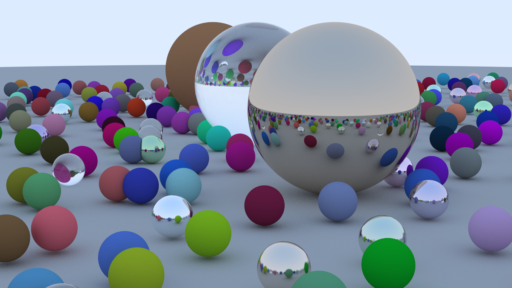

# Ray Tracking in One Weekend

## Introduction
This project is a preparation for my Mini-RT project.

This project is a personal reimplementation of the techniques discussed in the incredible book, [Ray Tracing in One Weekend](https://raytracing.github.io/books/RayTracingInOneWeekend.html). 

The entire project is rewritten in C.

Attached is the final picture of the project.
All features are implemented except defocus which is not neccessary in Mini-RT project.

